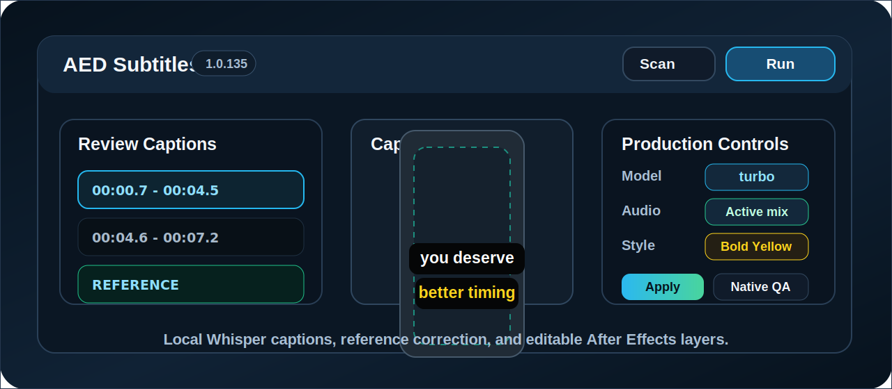

<h1 align="center">AED Subtitles</h1>

<p align="center">
  <strong>Local Whisper captions for Adobe After Effects, built for editors who need Descript-style review, correction, timing, and native AE text layers.</strong>
</p>

<p align="center">
  <a href="https://github.com/Mr0b01/ae-auto-subtitles/releases/latest/download/AE-Auto-Subtitles-Installer-1.0.135.pkg"><strong>Download installer</strong></a>
  &nbsp;|&nbsp;
  <a href="https://github.com/Mr0b01/ae-auto-subtitles/releases/latest">Latest release</a>
  &nbsp;|&nbsp;
  <a href="install.md">Install guide</a>
  &nbsp;|&nbsp;
  <a href="docs/troubleshooting.md">Troubleshooting</a>
  &nbsp;|&nbsp;
  <a href="docs/architecture.md">Architecture</a>
  &nbsp;|&nbsp;
  <a href="#workflow">Workflow</a>
</p>

<p align="center">
  <a href="https://github.com/Mr0b01/ae-auto-subtitles/releases/latest">
    
  </a>
  <a href="https://github.com/Mr0b01/ae-auto-subtitles/releases/latest/download/AE-Auto-Subtitles-Installer-1.0.135.pkg">
    
  </a>
  <a href="https://github.com/Mr0b01/ae-auto-subtitles/stargazers">
    
  </a>
  
  
</p>

<p align="center">
  
</p>

## Download

**Latest installer:** [AE-Auto-Subtitles-Installer-1.0.135.pkg](https://github.com/Mr0b01/ae-auto-subtitles/releases/latest/download/AE-Auto-Subtitles-Installer-1.0.135.pkg)

Open the [latest GitHub Release](https://github.com/Mr0b01/ae-auto-subtitles/releases/latest) if you want release notes, checksum details, or older assets.

The installer includes the CEP panel, local Python backend, ExtendScript renderer, bundled ffmpeg, offline Python wheels, and the cached Whisper Turbo model when it is available at build time. If the Turbo model is not bundled, the first transcription can download it automatically.

## Built For

AED Subtitles is for After Effects editors who need captions to stay editable, timing-aware, and visually controlled inside the comp.

| If this is your problem | AED Subtitles gives you |
| --- | --- |
| Whisper hears Hinglish, names, or phrasing wrong | Reference Text alignment before creating AE layers |
| Montage edits split speech across many clips | `Active comp mix`, which transcribes the comp as heard |
| Captions need review before timeline clutter | Review Captions with source/status labels |
| Only a few captions changed | `Apply Changed` instead of rebuilding everything |
| Timing/layout bugs are hard to prove | Native QA with real AE layout and timing self-tests |

## Why This Exists

Raw SRT imports are not enough for short-form edits. AED Subtitles is built around the workflow editors actually need inside After Effects:

- capture the real active composition audio, not just one random source file
- run local Whisper transcription with Turbo as the default model
- review every caption before creating timeline layers
- paste a known-correct reference script when Whisper hears Hinglish, names, or phrasing wrong
- apply only changed captions when the reference text differs from the model text
- style captions before applying them, with defaults that are stable in AE
- generate editable native AE text layers instead of a burned-in video overlay
- run native self-tests from the panel when timing or layout feels wrong

## What You Get

| Feature | Why it matters |
| --- | --- |
| Local Whisper Turbo | Faster default transcription without sending edit audio to a web subtitle service. |
| Active comp mix | Captures every audible enabled layer in the composition. |
| Review Captions | Lets you inspect text before creating timeline layers. |
| Reference Text | Replaces model mistakes with known-correct wording. |
| Apply Changed | Applies only captions that changed after a reference pass. |
| Style preview | Keeps font, size, block width, offset, and preset choices in one panel. |
| Native AE layers | Creates editable text layers instead of a baked video overlay. |
| Native QA | Runs syntax, unit, real AE layout, and real AE timing checks. |

## Install In 5 Minutes

1. Download [AE-Auto-Subtitles-Installer-1.0.135.pkg](https://github.com/Mr0b01/ae-auto-subtitles/releases/latest/download/AE-Auto-Subtitles-Installer-1.0.135.pkg).
2. Run the installer.
3. Restart Adobe After Effects.
4. In AE, enable `Settings -> Scripting & Expressions -> Allow Scripts to Write Files and Access Network`.
5. Open `Window -> Extensions -> AED Subtitles`.

If macOS warns that the package is from an unidentified developer, right-click the `.pkg`, choose `Open`, then confirm. The current installer is unsigned.

## Quick Run

1. Open an After Effects composition.
2. Open `Window -> Extensions -> AED Subtitles`.
3. Keep `Active comp mix` selected.
4. Press `Scan` or `Rescan`.
5. Wait for Whisper Turbo or press `Retiming`.
6. Review the captions.
7. Choose a style and placement.
8. Press `Run`.

## Workflow

```text
Open comp
  -> Scan / Rescan
  -> Background Whisper Turbo
  -> Review Captions
  -> Optional reference text
  -> Pick style, font, position, size
  -> Run or Apply Changed
  -> Editable AE subtitle layers
```

### 1. Scan The Composition

`Active comp mix` is the default source. It renders the audible composition mix and transcribes what the editor actually hears. This avoids gaps caused by montage timelines where voice is split across many edited clips.

Manual file-backed sources are still available when you intentionally want to transcribe a specific clip.

### 2. Review Captions

`Review Captions` shows the current subtitle file before AE layers are created. It marks model text, reference-filled captions, and changed captions so you can see what will be applied.

### 3. Correct With Reference Text

Paste the known-correct script when the model gets words wrong. The aligner keeps the transcript timing where it can, fills missing Whisper gaps from the reference, and marks captions that changed.

### 4. Apply Only What Changed

`Apply Changed` updates only captions whose text differs from the model output. Already-approved layers can stay in place.

### 5. Run Native QA

`Native QA` checks the plugin from the installed panel:

- JavaScript and JSX syntax
- Python compile checks
- unit smoke tests
- real AE layout self-test
- real AE timing self-test

## Current Defaults

| Setting | Default |
| --- | --- |
| Version | `1.0.135` |
| STT model | `turbo` |
| Audio source | `Active comp mix` |
| Preset | `Bold: Yellow highlight` |
| Size | `48 px` |
| Stroke width | `0 px` |
| Max chars | `42` |
| Block width | `900 px` |
| Block scale | `91%` |
| Offset Y | `+224 px` |
| Offset X | `0 px` |

## Models

Default:

- `turbo`

Manual fallbacks:

- `small`
- `medium`
- `large-v3`

Press `Retiming` after changing the model or changing composition audio. That regenerates transcript timings before captions are applied.

## Included Styles

The visible preset list focuses on styles that render predictably in After Effects:

- Classic
- Clean paragraph
- Modern yellow
- Bold yellow highlight
- Reels bold yellow
- Bold two words
- Static marker karaoke

Dark backplate and Hug Lines style systems are not the default release path yet. They need a new renderer path before they can be trusted in real AE output.

## Stable vs Experimental

| Area | Status |
| --- | --- |
| Active comp mix transcription | Stable default |
| Turbo model transcription | Stable default |
| Reference text correction | Stable enough for production review |
| Apply Changed | Stable for changed-text updates |
| Native AE text layers | Stable default output |
| Dark backplates / Hug Lines | Experimental, not the default renderer path |
| Fresh-machine installer signing | Unsigned beta package |

## Requirements

- macOS
- Adobe After Effects with CEP / ExtendScript support
- Python 3 available on the machine
- AE scripting access enabled
- Internet on first Turbo run if the model is not already bundled or cached

## Troubleshooting

Full troubleshooting guide: [docs/troubleshooting.md](docs/troubleshooting.md)

### The panel is not visible in After Effects

Restart After Effects after installing, then open `Window -> Extensions -> AED Subtitles`.

### Run does nothing or AE cannot create layers

Enable `Settings -> Scripting & Expressions -> Allow Scripts to Write Files and Access Network`, then restart AE.

### The first transcription is slow

The first Turbo run may download the model. Later runs use the local cache.

### Captions are correct but timing is wrong

Use `Active comp mix`, then press `Retiming`. If audio or model settings changed, old timings are stale.

### Timeline layers look like tiny red shards

That usually means a bad timing pass compressed many captions into too little time. Press `Rescan`, keep `Active comp mix`, then run `Retiming` before applying.

### Need logs

Use `Copy Log` in the panel. Runtime files are written under `tmp/` inside the installed extension or development checkout.

## Developer Setup

Contributor guide: [CONTRIBUTING.md](CONTRIBUTING.md)

```bash
git clone https://github.com/Mr0b01/ae-auto-subtitles.git
cd ae-auto-subtitles
python3 -m venv .venv
source .venv/bin/activate
pip install --upgrade pip
pip install -r backend/requirements.txt
```

Symlink the CEP panel:

```bash
mkdir -p "$HOME/Library/Application Support/Adobe/CEP/extensions"
ln -snf "$(pwd)/panel" \
  "$HOME/Library/Application Support/Adobe/CEP/extensions/com.airliner.aeautosubtitles"
```

Enable CEP debug mode when developing:

```bash
defaults write com.adobe.CSXS.10 PlayerDebugMode 1
```

## Build Installer

Release checklist: [docs/release-checklist.md](docs/release-checklist.md)

```bash
zsh packaging/build_pkg.sh
```

The package is written to:

```text
dist/AE-Auto-Subtitles-Installer-<version>.pkg
```

## Verification

```bash
sh scripts/preflight.sh
python "$HOME/Library/Application Support/Adobe/CEP/extensions/com.airliner.aeautosubtitles/scripts/native_qa.py"
```

## Project Layout

```text
panel/          CEP panel UI
backend/        transcription and postprocessing
scripts/        ExtendScript renderer and native QA helpers
config/         caption style presets
packaging/      macOS installer builder
tests/          regression and smoke tests
release-notes/  release notes used by GitHub Releases
```

## Release Status

Current source version: `1.0.135`

Latest installer: [AE-Auto-Subtitles-Installer-1.0.135.pkg](https://github.com/Mr0b01/ae-auto-subtitles/releases/latest/download/AE-Auto-Subtitles-Installer-1.0.135.pkg)

README benchmark notes: [docs/readme-benchmark.md](docs/readme-benchmark.md)
